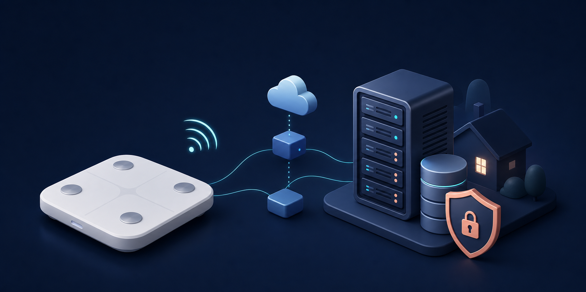

# 斐讯 S7 → Hermes 数据桥



这个项目把斐讯 S7 的测量结果送入自建 Hermes：

```text
S7 ──Wi-Fi──> 派健康云 ──轮询/自动认领──> Hermes S7 collector
                                           ├─ SQLite（唯一事实来源）
                                           ├─ JSONL / CSV / 每日汇总
                                           └─ hermes-summary.json → HermesAgent
```

你只需要在第一次把秤绑定到派健康，之后在秤已联网、派健康云仍可用时正常站上去测量即可。collector
会在后台轮询派健康、自动认领待认领数据、按体重范围区分两个人，并在一个短
测量会话内计算平均值。手机不需要每天打开派健康，也不需要手动抄数；如果云端
或认证失效，健康检查会显示降级并需要按故障章节处理。

> 体脂是派健康的消费级估算值。没有手持电极时，不要把它描述为完整的八电极
> 测量结果。

## 从零开始：按这个顺序部署

### 0. 准备条件

- 一台斐讯 S7，且能正常开机、显示体重。
- 一台 Android 手机安装派健康，用你自己的账号登录。抓取认证信息时只操作
  自己的手机和账号。
- 一台运行 Linux + Docker Engine + Python 3.11+ 的 Hermes 主机；主机与体脂秤在
  同一可信局域网（安装脚本用 Python 校验 TOML 配置）。
- 一个只给本项目使用的 MQTT 密码。不要把账号、令牌、健康明细提交到 Git。

### 1. 先让 S7 接入派健康（只做一次）

派健康里的型号名称可能写成“智能体脂秤 S7（第三方设备）”，不要因为没有
“斐讯”二字就选错型号。按下面顺序操作：

1. 路由器开启独立的 **2.4 GHz Wi-Fi**，配网时让手机也连接这个网络；S7
   不支持 5 GHz。遇到卡在某个百分比时，先关闭 5 GHz 或把 2.4 GHz 与 5 GHz
   分成两个 SSID。
2. 派健康 → **设备** → **添加设备** → 选择 S7（第三方设备），填写当前人的
   身高、年龄等资料，然后选择“手动绑定”。
3. 按住体脂秤背面的 **Reset 约 5 秒**，屏幕出现配网状态后，在 App 中选择
   家里的 2.4 GHz Wi-Fi 并输入密码，等待绑定完成；Wi-Fi 指示灯稳定亮起才算
   成功。
4. 先测一次，确认历史记录里能看到体重/体脂。若出现“数据认领”，点一次
   “认领”验证云端数据链路；这不是日常操作，collector 开启 `auto_claim` 后
   会自动做同样的事。

可参考这些图文资料（第三方页面可能随时失效）：

- [百度经验：派健康怎么连接斐讯体脂秤](https://jingyan.baidu.com/article/c33e3f48a99d47ab14cbb52f.html)：包含添加设备、手动绑定、配 Wi-Fi 的页面顺序。
- [斐讯 S7 体脂秤联网教程与第三方 App 说明](https://blog.46cbm.top/share/209.html)：说明 S7 只用 2.4 GHz，以及派健康中的第三方设备入口。

### 2. 在 Hermes 主机准备项目

在 Hermes 主机上执行，路径可按自己的习惯修改：

```bash
git clone https://github.com/peterhon168/phicomm-s7-hermes-bridge.git
cd phicomm-s7-hermes-bridge/deploy
cp .env.example .env
cp config.example.toml config.toml
chmod 600 .env
```

编辑 `deploy/.env`：

```dotenv
# 改成 Hermes 主机在局域网中的地址；不要暴露到公网
MQTT_BIND_ADDRESS=192.168.1.10
MQTT_USERNAME=s7
MQTT_PASSWORD=换成至少 20 个字符的随机值

# 主机上的持久化目录，SQLite/JSONL/CSV 都会写在这里
HERMES_SCALE_DIR=/srv/hermes-s7/data/weight
HERMES_SCALE_UID=10001
HERMES_SCALE_GID=10001
HEALTH_PORT=18087

# 仅在启用派健康适配器时需要
PAI_AUTH_FILE=/srv/hermes-s7/pai-auth.json
```

创建数据目录，并让 UID/GID 与 `.env` 中的值一致：

```bash
sudo install -d -o 10001 -g 10001 -m 0750 /srv/hermes-s7/data/weight
```

然后编辑 `deploy/config.toml`。下面的体重范围和初始值是合成示例，必须替换成
你自己的设置：

```toml
[pai]
enabled = true
auth_file = "/etc/hermes-s7/pai-auth.json"
poll_interval_seconds = 60
auto_claim = true

[[people]]
id = "person_a"
name = "Person A"
min_weight_kg = 85.0
max_weight_kg = 110.0
initial_weight_kg = 92.0

[[people]]
id = "person_b"
name = "Person B"
min_weight_kg = 45.0
max_weight_kg = 70.0
initial_weight_kg = 58.0
```

把示例中的两个人改成实际使用的显示名和不重叠范围。系统会优先按范围、近期
基线和会话平均值分配；无法安全判断时会保留为待复核，不会静默塞进错误的人。

### 3. 放入派健康认证文件（不要提交）

collector 需要一个仅在 Hermes 主机上存在的 `pai-auth.json`。文件必须包含
`appId`、`appSecret`、`appVersion`、`platform`、`timeZone`、`token`、`userId`
和正整数 `memberId`；字段值来自你自己的派健康会话。

如果你已经有私有认证文件，直接按下面的格式检查并安装即可。若还没有，需在
自己拥有的 Android 设备上完成一次受控的 HTTPS 调试/认证采集；仓库中的 addon
只输出脱敏后的请求形状，不会自动导出 Token，也不会替你保存抓包文件。这是
刻意的安全边界：不要把真实值贴到 issue、README 或聊天记录中。

```json
{
  "appId": "REPLACE_WITH_PRIVATE_VALUE",
  "appSecret": "REPLACE_WITH_PRIVATE_VALUE",
  "appVersion": "REPLACE_WITH_PRIVATE_VALUE",
  "platform": "REPLACE_WITH_PRIVATE_VALUE",
  "timeZone": "Asia/Shanghai",
  "token": "REPLACE_WITH_PRIVATE_VALUE",
  "userId": "REPLACE_WITH_PRIVATE_VALUE",
  "memberId": 123456
}
```

保存到 `.env` 的 `PAI_AUTH_FILE` 指定位置，并设置权限：

```bash
sudo install -o 10001 -g 10001 -m 0600 \
  /path/to/pai-auth.json /srv/hermes-s7/pai-auth.json
```

`10001:10001` 必须与 `.env` 中的 `HERMES_SCALE_UID/GID` 一致；如果你修改了
示例 UID/GID 或 `PAI_AUTH_FILE`，请同步替换上面命令中的值和路径。文件保持
`0600`，并由 collector 运行用户拥有，这样容器内的只读挂载才能被 Pai 适配器读取。

认证文件、抓包、Cookie、Token、App Secret 和个人健康数据都不属于公开仓库。
仓库中的 [`scripts/pai_capture_addon.py`](scripts/pai_capture_addon.py) 只输出
脱敏后的请求形状和测量字段，不能替代安全的私有认证材料管理；详见
[`SECURITY.md`](SECURITY.md)。

### 4. 启动并验收

当前 Pai 路径推荐使用原生 Docker 安装脚本：它会构建固定版本镜像、挂载认证
文件、创建 MQTT/collector，并设置 `restart: unless-stopped`：

```bash
cd /path/to/phicomm-s7-hermes-bridge/deploy
sudo ./install-with-docker.sh
```

检查服务：

```bash
curl -fsS http://127.0.0.1:18087/health | jq
docker ps --filter name=hermes-s7-
```

健康响应中的 `status` 应为 `ok`；`pai_last_error` 应为 `null`。`18087` 是示例
中的默认 `HEALTH_PORT`，如果你改过 `.env`，请替换为实际端口。第一次轮询
可能需要等待一个 `poll_interval_seconds` 周期。日志只用于排查错误，不要把含
认证头或个人数据的完整日志贴到公开 issue。

如果只做 zS7/MQTT 的本地权重回退，可按 [`docs/DEPLOYMENT.md`](docs/DEPLOYMENT.md)
使用 Compose。启用 Pai 时请使用上面的原生 Docker 安装脚本，因为它会按
`PAI_AUTH_FILE` 自动做只读挂载；不要在未挂载认证文件的 Compose 配置上直接打开
`[pai].enabled`。

### 5. 做一次端到端测试

1. 在秤上完成一次测量；首次测试可以连续测 2–3 次，便于验证会话平均值。
2. 等待一个轮询周期，检查 `docker logs hermes-s7-collector` 是否出现同步成功。
3. 查看持久化目录中的文件：

   ```text
   scale.sqlite3                 # 唯一事实来源
   hermes-summary.json           # HermesAgent 读取入口
   raw/YYYY/MM/*.jsonl           # 原始归一化事件
   users/<person-id>/measurements.csv
   users/<person-id>/daily-summary.json
   ```

4. 用两个明显不同体重的测试用户各测一次，确认数据进入不同的
   `people.<id>` 分栏。体脂字段可能为空；无手柄时保留为派健康估算即可。

如果升级前已经出现“按时间逆序返回、导致一次测量被拆成多个会话”，先部署包含
本修复的版本，再在维护窗口执行：

```bash
cd /path/to/phicomm-s7-hermes-bridge/deploy
sudo ./rebuild-sessions-with-docker.sh
```

脚本会短暂停止 collector，从 SQLite 原始测量账本按时间重建会话和导出文件，然后
自动启动 collector；不会删除原始记录。

### 6. 一次性登记 HermesAgent 数据源

在 Hermes 的 **health profile** 中登记：

```text
<HERMES_SCALE_DIR>/hermes-summary.json
```

登记为只读来源，并声明读取 `people.person_a` 与 `people.person_b` 两个命名空间，
只把 `finalized` 会话和每日汇总用于趋势。不要把 JSON 复制进 profile；保持一个
规范文件，避免两份数据漂移。详细的数据契约、合并旧历史和绘图规则见
[`docs/HERMES_AGENT_INTEGRATION.md`](docs/HERMES_AGENT_INTEGRATION.md)。

### 7. 以后每天怎么用

日常只需站上秤测量（秤已联网时）：

```text
测量 → S7 通过 Wi-Fi 上传派健康 → collector 定时轮询/自动认领
     → SQLite 去重、按人分栏、会话平均 → hermes-summary.json
     → HermesAgent 在回答健康问题或生成折线图时读取
```

如果要生成包含 4 月起始数据的折线图，让 HermesAgent 同时读取旧健康日记和
本来源；旧数据不需要迁移进 S7 文件，合并规则会保留历史基线并避免同一天重复
计入。collector 停止或派健康暂时不可用时，已经写入本地的数据仍然可读。

## 常见问题

| 现象 | 先检查 |
| --- | --- |
| 配网卡住或找不到秤 | 手机和秤都在独立 2.4 GHz；不要让 5 GHz 与它共用一个 SSID；重新长按 Reset 5 秒。 |
| 派健康出现“数据认领” | 先手动认领一条确认账号链路；之后打开 `[pai] auto_claim = true`，collector 会自动认领。 |
| `/health` 为 `degraded` | 查看 `pai_last_error` 和 collector 日志；常见原因是认证过期、主机无法访问派健康或数据目录权限错误。 |
| 两个人分错栏 | 缩小并错开 `min_weight_kg`/`max_weight_kg`，保留足够的 `ambiguity_margin_kg`；不要为了“强行归类”扩大重叠范围。 |
| 三次连续测量被拆成多个会话 | 先升级到包含 Pai 历史排序修复的版本，再运行 `sudo ./rebuild-sessions-with-docker.sh`；它会从 SQLite 重建，不会重复插入记录。 |
| 体脂看起来不准 | 没有手持电极时它只是消费级估算；项目会保存字段，但不会伪造八电极结果。 |
| MQTT 容器提示 `password_file` 已存在 | 不要删除持久卷；当前 entrypoint 会更新已有账户，重新执行安装脚本即可。 |

## 派健康失效时怎么办

本项目把派健康当作可替换的数据源，而不是数据库。已经收集的数据在本地
SQLite/JSONL/CSV 中，先备份这些目录，再按 [`docs/FAILOVER.md`](docs/FAILOVER.md)
选择 zS7 + MQTT（权重）、UART 网关或替换为本地协议体脂秤。体脂不能从体重反推，
缺少本地阻抗协议时宁可留空，也不要用猜测公式冒充原始测量。

## 开发与测试

```bash
python3 -m venv .venv
.venv/bin/pip install -e .
.venv/bin/python -m unittest discover -s tests -v
```

更多内容：

- [`docs/DATA_CONTRACT.md`](docs/DATA_CONTRACT.md)：规范化测量、会话平均和导出文件。
- [`docs/DEPLOYMENT.md`](docs/DEPLOYMENT.md)：Docker/Compose、存储和备份说明。
- [`docs/FAILOVER.md`](docs/FAILOVER.md)：脱离派健康后的迁移路线。
- [`CONTRIBUTING.md`](CONTRIBUTING.md)：贡献前检查。
- [`SECURITY.md`](SECURITY.md)：公开仓库的凭据和健康数据边界。

## 当前状态

Pai 轮询、自动认领、体重/体脂解析、双人分栏、会话平均、SQLite/JSONL/CSV 导出、
`hermes-summary.json` 和 MQTT 权重回退均已实现。Pai 适配器默认关闭；启用前必须
提供自己的认证文件。
